Maniac Framework (for Unity project)
--
## Features:
- DataBase
- UI
- Profile (Save/Load)
- Spawner
- LanguageTable (Localization)
- Audio
- Messenger
- Time
- Other helper Utils

## Here is how to get into your project.
Guide:
- Step 1: Clone this repo as a submodule into your Unity project. You can put it in
 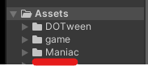
- Step 2: There will be a lot of errors. I know, **DON'T PANIC** ☠. Follow this sub steps.
  - Step 2.1: Install [Dotween](http://dotween.demigiant.com/getstarted.php).
  - Step 2.2: Install [Unitask](https://github.com/Cysharp/UniTask/releases).
  - Step 2.3: Install [UniRx](https://github.com/neuecc/UniRx/releases).
  - Dotween is for UI animation transitions.
  - Unitask is for async await programming
  - UniRx is for using Observer pattern.
- Step 3: Hopefully at this point. There will be no errors.
- Step 4: Open Bootstrap scene in Maniac/Bootstrap
 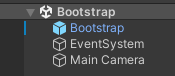
- Step 5: You need to create some scriptable objects for Bootstrap script 
 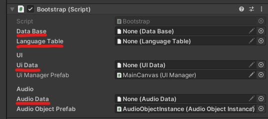
- Step 6: Just follow these. You'll be fine. 
 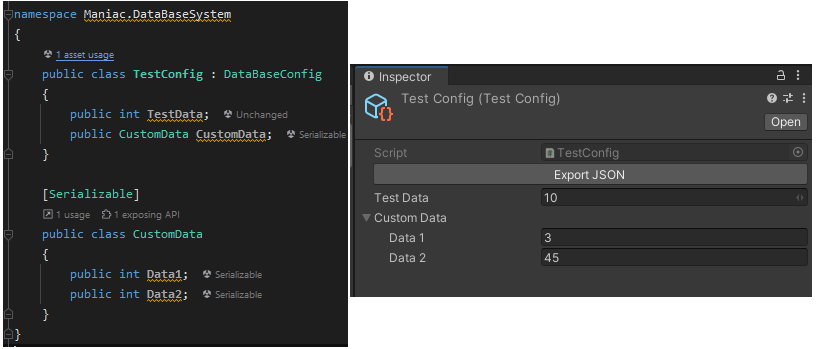
- Step 7: After followed 4 steps. You will have 4 scriptable object which located at Assets/Resources/ 
 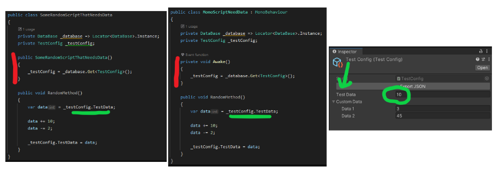
- Step 8: Put all those scriptable objects into Bootstrap.
- Step 9: Run the Scene. If there is no error. You have completed implemented Maniac Framework into your project.
 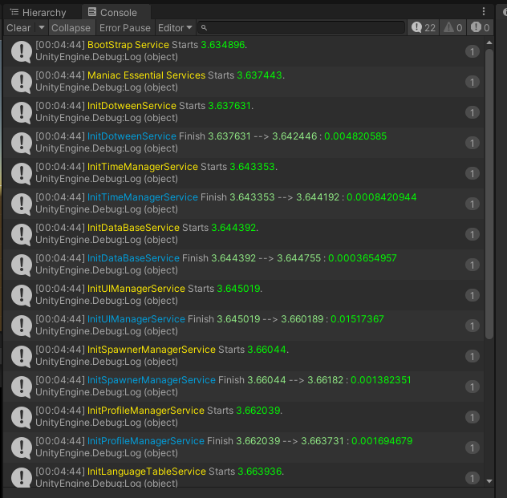

# Note: use Locator<>.Instance as Singleton 

## DataBase System
### Storing your game data as a scriptable object and get it during runtime with ease.

- Create your own scriptable object in second. (I'll prefer to call it xxxConfig)
 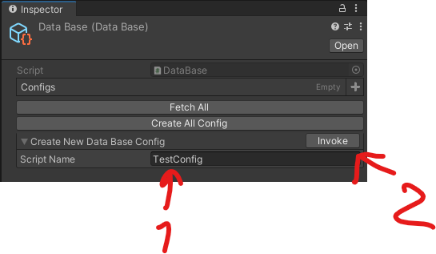

- All configs(and their scripts) will be stored at Assets/Recources/DatabaseConfigs
 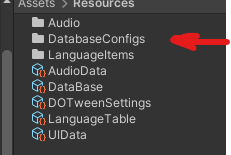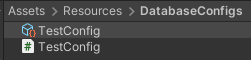

- You can custom any data of any kind into your script and edit it in editor.

- You can get it any where during runtime using example like this.

## UI System
### Create UI base in seconds. Edit it however you want. Show and Close it with ease.

- Make some UI Layers. This will help you later when you need some UIs to always be on top of some others 
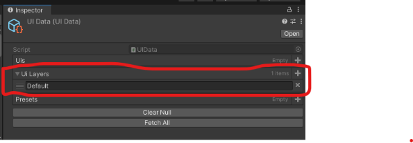

- Create your new UI.
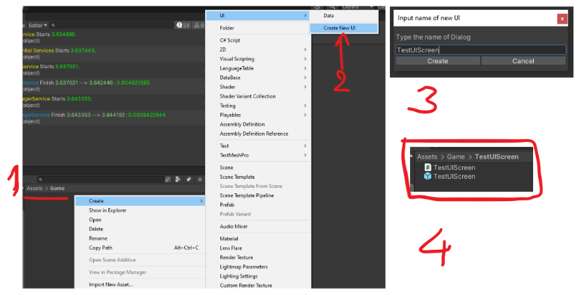
 
-