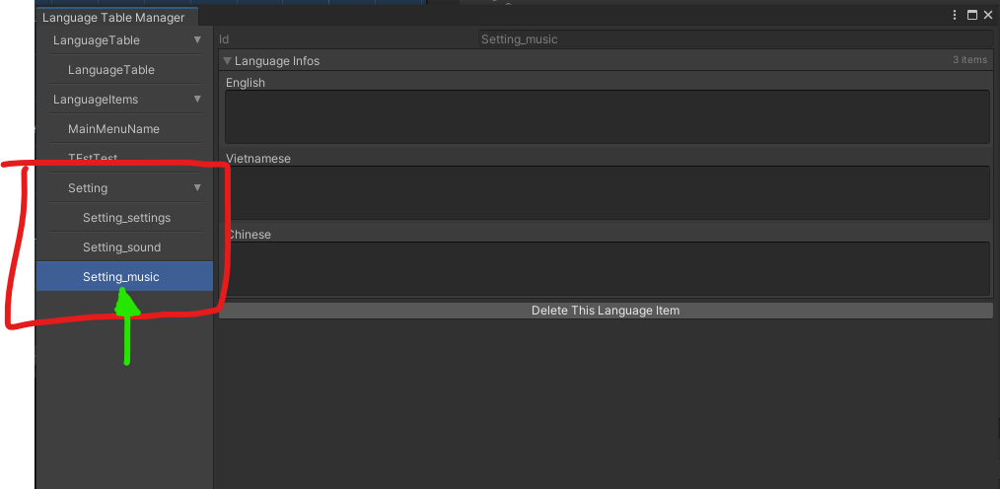

Maniac Framework (for Unity project)
--
## Features:
- DataBase
- UI
- Profile (Save/Load)
- Spawner
- LanguageTable (Localization)
- Audio
- Messenger
- Time
- Other helper Utils

## Here is how to get into your project.
Guide:
- Step 1: Clone this repo as a submodule into your Unity project. You can put it in

- Step 2: There will be a lot of errors. I know, **DON'T PANIC** ☠. Follow this sub steps.
  - Step 2.1: Install [Dotween](http://dotween.demigiant.com/getstarted.php).
  - Step 2.2: Install [Unitask](https://github.com/Cysharp/UniTask/releases).
  - Step 2.3: Install [UniRx](https://github.com/neuecc/UniRx/releases).
  - Dotween is for UI animation transitions.
  - Unitask is for async await programming
  - UniRx is for using Observer pattern.
  
- Step 3: Hopefully at this point. There will be no errors.

- Step 4: Open Bootstrap scene in Maniac/Bootstrap

 

- Step 5: You need to create some scriptable objects for Bootstrap script 

 

- Step 6: Just follow these. You'll be fine. 

 

- Step 7: After followed 4 steps. You will have 4 scriptable object which located at Assets/Resources/ 

 

- Step 8: Put all those scriptable objects into Bootstrap.

- Step 9: Run the Scene. If there is no error. You have completed implemented Maniac Framework into your project.

 

# Note: use Locator<>.Instance as Singleton 

## DataBase System
### Storing your game data as a scriptable object and get it during runtime with ease.

- Create your own scriptable object in second. (I'll prefer to call it xxxConfig)

 

- All configs(and their scripts) will be stored at Assets/Recources/DatabaseConfigs

 

- You can custom any data of any kind into your script and edit it in editor.

- You can get it any where during runtime using example like this.

## UI System
### Create UI base in seconds. Edit it however you want. Show and Close it with ease.

- Make some UI Layers. This will help you later when you need some UIs to always be on top of some others 

- Create your new UI.

 
- Choose your desired transition, layer, basic setting

- Show and Close UI example

- There are more methods in BaseUI.cs class. Take a look at it. 

## Profile (Save/Load) System
### create a Json Save/Load system with ease

- Make a class which store data that need to be saved , and inherit from ProfileRecord

- You can check your saved files here !

## Spawner (Object Pooling) System
### Object Pool using Unity ObjectPool<T>

- Create any prefab that you want to clone, and clone it like example
- **Notice**
- After Changing Scene to Scene, you need to reset all of the spawner

## LanguageTable (Localization) System
### Localization system for all type of texts

- Create languages that you want to have in your project

- Create Language Item for any text that you want to be localized.

- Open Language Table and edit the language item that you just created

- You can make a TMP_Text, automatically change to other language using LanguageText component. Remember to Add the LanguageItem for it :P

- Sometime during runtime, you may need to use the LanguageItem in script. Here is how to do it.

- Small Tips. Use "_" to make LanguageItem goes into its own section

## Audio System
### audio for 2d games, it could be use in 3d games, but you need to read down into the code a bit

- Step by Step
- Create new Audio Info ,  Add AudioClip into variations

- During runtime when you need to play that sound. This is how to do it in script

